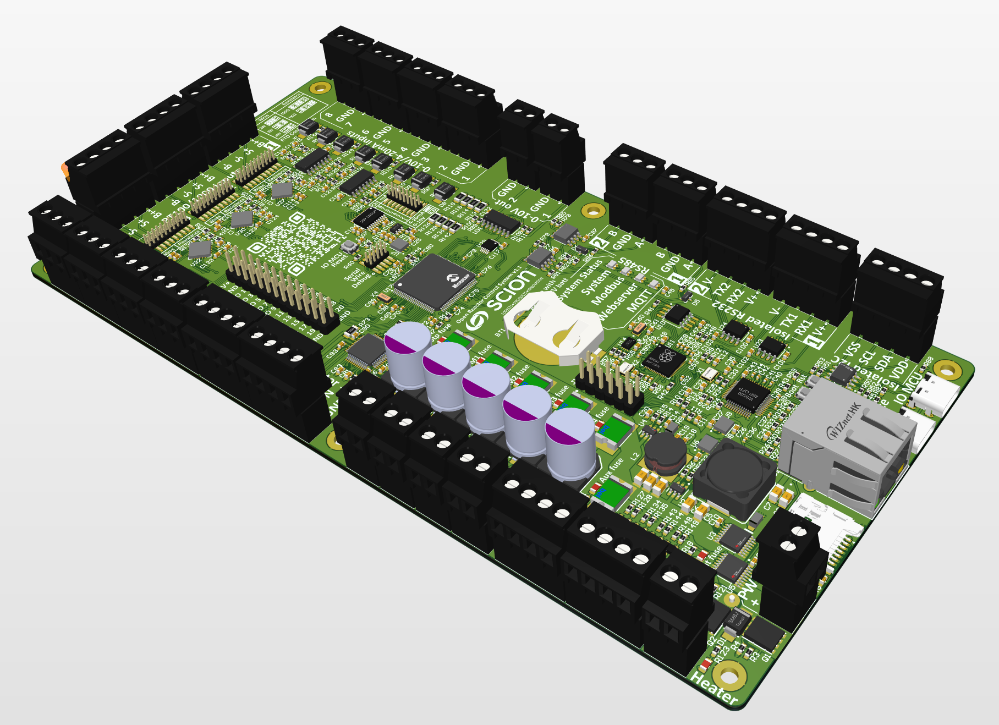

# Open Reactor Control System

A unified control platform for bioreactor systems, featuring a dual microcontroller architecture for robust control and monitoring capabilities.

## Hardware Architecture

The system is built around two microcontrollers:

1. **System Controller (RP2040)**
   - Primary system controller
   - Handles user interface and high-level control
   - Based on the Raspberry Pi RP2040 microcontroller
   - USB connectivity for configuration and monitoring

2. **I/O Controller (SAMD51)**
   - Dedicated I/O processing
   - Real-time sensor monitoring and control
   - Based on the Microchip SAMD51 microcontroller
   - Provides reliable, deterministic I/O handling

## Project Structure

- `orc-sys-mcu/`: System Controller firmware (RP2040)
- `orc-io-mcu/`: I/O Controller firmware (SAMD51)
- `hardware/`: Hardware design files and documentation
  - Schematics
  - Pin assignments
  - PCB design files

## PCB Assembly

## Current Status

This project is currently under active development. The basic hardware and firmware architecture is established, with ongoing work to implement and refine the control and monitoring capabilities.

## Development

This is a PlatformIO-based project. Each microcontroller has its own PlatformIO project configuration and can be built and programmed independently.
